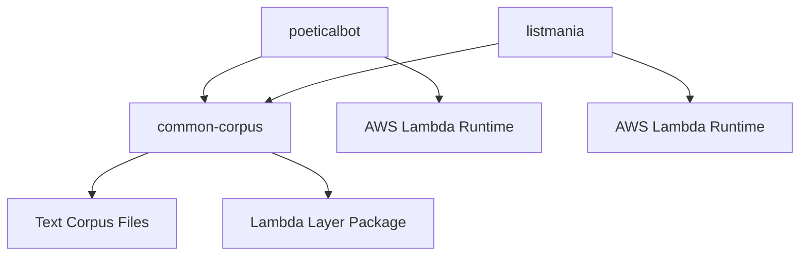

# Design Document

## Overview

This design outlines the migration of three separate Node.js applications (PoeticalBot, common-corpus, and listmania) into a unified Nx-based monorepo structure. The design follows the established pattern from genart-monorepo, leveraging Nx for task orchestration, pnpm for package management, and maintaining AWS Lambda deployment capabilities for all applications.

The migration will transform individual repositories into a cohesive workspace that enables shared tooling, dependency management, and streamlined development workflows while preserving each application's unique functionality and deployment requirements.

## Architecture

### Monorepo Structure

```
nlp-monorepo/
├── apps/
│   ├── poeticalbot/           # Poetry generation bot (Lambda)
│   │   ├── src/
│   │   ├── lambda/            # AWS Lambda configuration
│   │   ├── terraform/         # Infrastructure as code
│   │   ├── docs/              # Application-specific docs
│   │   ├── project.json       # Nx project configuration
│   │   └── package.json
│   └── listmania/             # List generation bot (Lambda)
│       ├── src/
│       ├── lambda/            # New Lambda configuration
│       ├── terraform/         # New infrastructure as code
│       ├── project.json       # Nx project configuration
│       └── package.json
├── libs/
│   └── common-corpus/         # Shared text corpus library
│       ├── src/
│       ├── corpus/            # Text files and data
│       ├── lambda-index.js    # Lambda-optimized version
│       ├── project.json       # Nx library configuration
│       └── package.json
├── docs/                      # Consolidated documentation
├── tools/                     # Build and deployment scripts
├── .kiro/                     # Consolidated Kiro configuration
├── nx.json                    # Nx workspace configuration
├── pnpm-workspace.yaml        # pnpm workspace configuration
├── package.json               # Root package.json with shared dependencies
└── README.md                  # Monorepo documentation
```

### Technology Stack

- **Build System**: Nx 21.6.4+ for task orchestration and dependency management
- **Package Manager**: pnpm with workspace support for efficient dependency management
- **Runtime**: Node.js 18+ (standardized across all applications)
- **Deployment**: AWS Lambda with individual terraform configurations
- **Testing**: Mocha with nyc for coverage (existing pattern)
- **Linting**: ESLint with shared configuration
- **Documentation**: Consolidated docs/ directory with application-specific subdirectories

## Components and Interfaces

### Nx Workspace Configuration

**nx.json**
```json
{
  "installation": {
    "version": "21.6.4"
  },
  "plugins": [
    "@nx/js/plugin"
  ],
  "release": {
    "projectsRelationship": "independent",
    "projects": ["apps/*"],
    "releaseTagPattern": "{projectName}@{version}"
  },
  "targetDefaults": {
    "build": {
      "cache": true
    },
    "test": {
      "cache": true
    },
    "lint": {
      "cache": true
    }
  }
}
```

**pnpm-workspace.yaml**
```yaml
packages:
  - 'apps/*'
  - 'libs/*'
```

### Application Configurations

#### PoeticalBot (apps/poeticalbot/project.json)
```json
{
  "name": "poeticalbot",
  "sourceRoot": "apps/poeticalbot/src",
  "projectType": "application",
  "targets": {
    "build": {
      "executor": "@nx/js:tsc",
      "options": {
        "outputPath": "dist/apps/poeticalbot",
        "main": "apps/poeticalbot/src/index.js"
      }
    },
    "test": {
      "executor": "@nx/js:node",
      "options": {
        "command": "mocha --timeout 50000 ./test/*.tests.js"
      }
    },
    "deploy": {
      "executor": "@nx/js:node",
      "options": {
        "command": "cd terraform && terraform apply"
      }
    }
  },
  "implicitDependencies": ["common-corpus"]
}
```

#### Listmania (apps/listmania/project.json)
```json
{
  "name": "listmania",
  "sourceRoot": "apps/listmania/src",
  "projectType": "application",
  "targets": {
    "build": {
      "executor": "@nx/js:tsc",
      "options": {
        "outputPath": "dist/apps/listmania",
        "main": "apps/listmania/src/index.js"
      }
    },
    "test": {
      "executor": "@nx/js:node",
      "options": {
        "command": "mocha --timeout 50000 ./test/*.tests.js"
      }
    },
    "deploy": {
      "executor": "@nx/js:node",
      "options": {
        "command": "cd terraform && terraform apply"
      }
    }
  },
  "implicitDependencies": ["common-corpus"]
}
```

#### Common-Corpus Library (libs/common-corpus/project.json)
```json
{
  "name": "common-corpus",
  "sourceRoot": "libs/common-corpus/src",
  "projectType": "library",
  "targets": {
    "build": {
      "executor": "@nx/js:tsc",
      "options": {
        "outputPath": "dist/libs/common-corpus",
        "main": "libs/common-corpus/index.js"
      }
    },
    "test": {
      "executor": "@nx/js:node",
      "options": {
        "command": "mocha test/"
      }
    },
    "build-layer": {
      "executor": "@nx/js:node",
      "options": {
        "command": "npm run build:layer"
      }
    }
  }
}
```

### Lambda Integration Architecture

#### Lambda Handler Wrapper Pattern
Each application will maintain its existing CLI-based functionality while adding a Lambda handler wrapper:

```javascript
// apps/poeticalbot/lambda/index.js
const { handler: cliHandler } = require('../src/cli');

exports.handler = async (event, context) => {
  try {
    // Convert Lambda event to CLI arguments
    const args = convertEventToArgs(event);
    
    // Execute existing CLI functionality
    const result = await cliHandler(args);
    
    return {
      statusCode: 200,
      body: JSON.stringify(result)
    };
  } catch (error) {
    return {
      statusCode: 500,
      body: JSON.stringify({ error: error.message })
    };
  }
};
```

#### Common-Corpus Lambda Layer Integration
The common-corpus library will support both direct usage and Lambda layer deployment:

```javascript
// libs/common-corpus/lambda-index.js (enhanced)
const path = require('path');

// Detect execution environment
const isLambda = !!process.env.AWS_LAMBDA_FUNCTION_NAME;
const isLayer = !!process.env.LAMBDA_LAYER_PATH;

// Dynamic path resolution
const getCorpusPath = () => {
  if (isLayer) {
    return '/opt/nodejs/node_modules/common-corpus/corpus';
  } else if (isLambda) {
    return path.join(__dirname, './corpus');
  } else {
    return path.join(__dirname, './corpus');
  }
};

module.exports = require('./index.js');
```

## Data Models

### Workspace Package Dependencies

```json
{
  "name": "nlp-monorepo",
  "private": true,
  "workspaces": ["apps/*", "libs/*"],
  "dependencies": {
    "compromise": "^13.8.0",
    "commander": "^7.0.0",
    "dotenv": "^8.2.0",
    "tumblr.js": "^5.0.0"
  },
  "devDependencies": {
    "@nx/js": "^21.6.4",
    "nx": "^21.6.4",
    "mocha": "^8.2.1",
    "nyc": "^15.1.0",
    "eslint": "^8.57.1",
    "standard": "^17.0.0"
  }
}
```

### Application-Specific Dependencies

Each application maintains its own package.json with specific dependencies:

- **PoeticalBot**: Maintains existing dependencies like `natural`, `pos`, `rhymes`
- **Listmania**: Maintains `corpora-project`, `fuzzy-matching`
- **Common-Corpus**: Maintains `iconv-lite`, `mkdirp`, text processing utilities

### Dependency Graph



## Error Handling

### Build Error Management
- Nx caching prevents redundant builds on unchanged code
- Individual application failures don't block other applications
- Clear error reporting through Nx task execution logs

### Runtime Error Handling
- Lambda functions maintain existing error handling patterns
- Common-corpus library includes enhanced error handling for missing files
- Graceful degradation when corpus files are unavailable

### Deployment Error Recovery
- Individual terraform configurations allow independent deployments
- Rollback capabilities maintained at the application level
- Infrastructure state isolation prevents cross-application deployment issues

## Testing Strategy

### Unit Testing
- Maintain existing Mocha test suites for each application
- Nx executors enable parallel test execution across applications
- Shared test utilities in libs/ for common testing patterns

### Integration Testing
- Cross-application integration tests in root-level test/ directory
- Lambda handler integration tests for event processing
- Common-corpus integration tests for both standard and lambda modes

### End-to-End Testing
- Deployment verification scripts in tools/ directory
- Lambda function invocation tests
- Tumblr API integration verification (where applicable)

### Test Execution Strategy
```bash
# Run all tests
nx run-many --target=test --all

# Run specific application tests
nx test poeticalbot

# Run tests with coverage
nx run-many --target=test --all --coverage
```

## Migration Strategy

### Phase 1: Workspace Setup
1. Initialize Nx workspace with required plugins
2. Configure pnpm workspace
3. Set up root-level package.json with shared dependencies
4. Create directory structure (apps/, libs/, docs/, tools/)

### Phase 2: Common-Corpus Migration
1. Move common-corpus to libs/common-corpus
2. Create Nx library configuration
3. Update package.json for workspace compatibility
4. Verify lambda-index.js functionality

### Phase 3: PoeticalBot Migration
1. Move PoeticalBot to apps/poeticalbot
2. Create Nx application configuration
3. Update common-corpus dependency to workspace reference
4. Verify existing Lambda deployment functionality

### Phase 4: Listmania Migration and Lambda Conversion
1. Move listmania to apps/listmania
2. Create Lambda handler wrapper around existing CLI functionality
3. Create terraform configuration for AWS Lambda deployment
4. Update common-corpus dependency to workspace reference
5. Test Lambda deployment and scheduling

### Phase 5: Documentation and Tooling
1. Consolidate documentation in docs/ directory
2. Create unified development scripts
3. Set up Nx task orchestration
4. Configure shared linting and formatting rules

### Phase 6: Validation and Optimization
1. Verify all applications function correctly in monorepo
2. Test deployment pipelines
3. Optimize shared dependencies and build caching
4. Document migration process and new development workflows