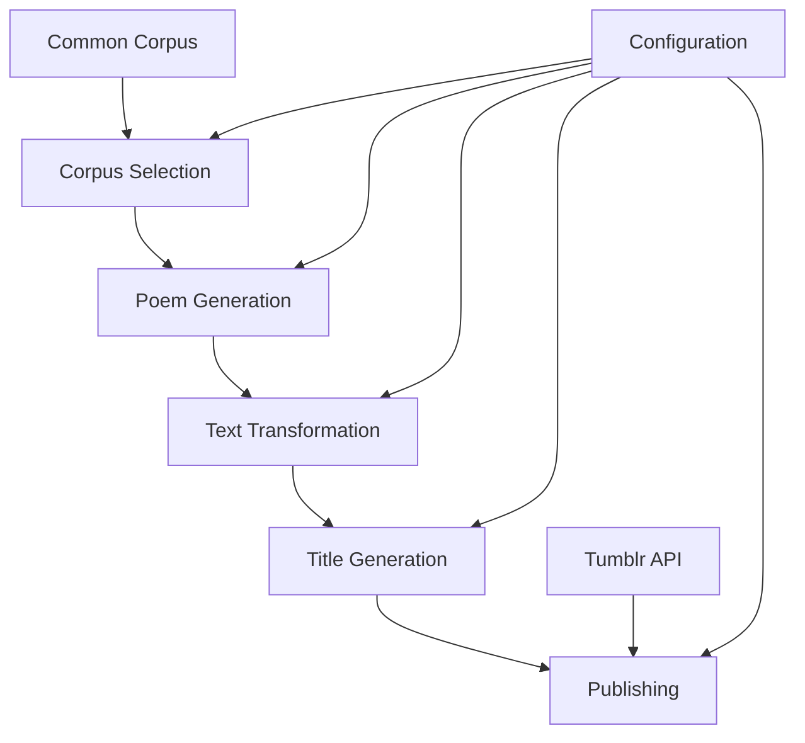

# PoeticalBot Architecture Documentation

## System Architecture

### High-Level Design

PoeticalBot follows a **modular pipeline architecture** designed for algorithmic poetry generation and automated social media publishing. The system is stateless and designed to run as both a CLI tool and a serverless function.



### Core Components

#### Poetifier (`lib/poetifier.js`)
**Purpose**: Main orchestration class that coordinates the entire poem generation pipeline.

**Key Responsibilities**:
- Load and configure text corpora
- Select poem generation strategy
- Apply text transformations
- Generate titles
- Return complete poem objects

**Architecture Pattern**: Factory pattern for creating generation strategies.

#### Generation Strategies

##### JGnoetry (`lib/jgnoetry/`)
**Algorithm**: Template-based poem generation using grammatical rules and syllable patterns.

**Components**:
- `jgnoetryRunner.js`: Main runner coordinating template processing
- `jgnoetry.headless.js`: Core JGnoetry algorithm implementation
- `templating.js`: Template parsing and application
- `syllable.exceptions.js`: Syllable counting rules

**Features**:
- Customizable templates (haiku, sonnet, free verse)
- Grammatical rule enforcement
- Syllable-aware line breaking

##### Queneau Buckets (`lib/bucketRunner.js`)
**Algorithm**: Raymond Queneau's combinatorial text rearrangement method.

**Process**:
1. Split source text into sentences/lines
2. Create "buckets" of interchangeable text units
3. Randomly combine units to create new arrangements
4. Apply structural constraints (line counts, stanza patterns)

**Strategies**:
- `incrementinglines`: Lines increase in length
- `decrementinglines`: Lines decrease in length
- `diamond`: Diamond-shaped stanza structure

##### Sentence Drone (`lib/sentence.drone.js`)
**Algorithm**: Repetitive sentence structures with controlled variation.

**Patterns**:
- **Bookends**: Same sentence at start and end
- **Alternating**: Pattern of repeated and varied sentences
- **Stanza-based**: Repeating sentences within stanza structures

#### Text Transformations (`filter/`)
**Purpose**: Apply stylistic modifications to generated poems.

**Available Transformations**:
- **Misspelling** (`node-mispelr`): Phonetic spelling variations
- **Sorting**: Alphabetical line rearrangement
- **Spacing**: Random leading space insertion
- **Rhyming**: Basic rhyme scheme application (proof-of-concept)

**Architecture**: Chain of responsibility pattern with configurable probability.

#### Title Generation (`lib/titlifier.js`)
**Strategies**:
- First/last/random line extraction
- Most common words analysis
- Summary sentence generation
- Random word combination

### Data Flow Architecture

#### Input Processing
```
Source Text → Sentence Segmentation → Word Tokenization → Part-of-Speech Tagging
```

#### Poem Generation Pipeline
```
Corpus Selection → Strategy Selection → Content Generation → Transformation → Titling → Validation
```

#### Output Formatting
```
Poem Object → NPF Conversion → Tumblr API → Post Creation
```

### Configuration Architecture

#### Configuration Sources
1. **Environment Variables**: API credentials and runtime settings
2. **Command Line Arguments**: Generation parameters and options
3. **Internal Defaults**: Fallback values for optional settings

#### Configuration Object Structure
```javascript
{
  // API Configuration
  consumerKey: string,
  consumerSecret: string,
  accessToken: string,
  accessSecret: string,
  postLive: boolean,

  // Generation Parameters
  method: 'jgnoetry' | 'queneau-buckets' | 'drone',
  corporaFilter: string,
  seed: string,
  reduce: boolean,
  transform: boolean,

  // Output Control
  log: boolean,
  file: string
}
```

### Deployment Architecture

#### Local Development
- **Entry Point**: `index.js` with Commander.js CLI
- **Environment**: Node.js process with dotenv configuration
- **Output**: Console logging or Tumblr posting

#### Production (AWS Lambda)
- **Entry Point**: `lambda/index.js`
- **Trigger**: CloudWatch Events (hourly schedule)
- **Environment**: Lambda execution context
- **Logging**: CloudWatch Logs
- **Error Handling**: Automatic retries and fallback to HTML format

#### Legacy Deployment (Heroku)
- **Entry Point**: `index.js` as worker process
- **Trigger**: Heroku Scheduler
- **Environment**: Heroku dyno with config vars

### External Interfaces

#### Tumblr API Integration
**Authentication**: OAuth 1.0a three-legged authentication
**API Version**: Tumblr API v2
**Format Support**:
- **Primary**: Neue Post Format (NPF) for modern Tumblr features
- **Fallback**: HTML format for compatibility

#### Common Corpus Integration
**Source**: GitHub-hosted npm package
**Content**: 124+ public domain texts (literature, technical, spam, etc.)
**Access Pattern**: Lazy loading with caching
**Filtering**: Regex-based corpus selection

### Error Handling Architecture

#### Error Types
- **Corpus Loading Errors**: Missing or corrupted text sources
- **Generation Errors**: Algorithm failures or invalid configurations
- **API Errors**: Tumblr authentication or posting failures
- **Configuration Errors**: Missing required environment variables

#### Error Recovery
- **Graceful Degradation**: Fallback to simpler algorithms
- **Retry Logic**: Exponential backoff for transient failures
- **Logging**: Comprehensive error logging with context
- **Fallback Publishing**: HTML format when NPF fails

### Performance Characteristics

#### Memory Usage
- **Corpus Loading**: ~50-100MB for full common-corpus
- **Generation**: Minimal additional memory for poem creation
- **Lambda Limits**: Well within AWS Lambda memory constraints

#### Execution Time
- **Typical Generation**: 2-5 seconds
- **Tumblr API**: 1-3 seconds
- **Total Lambda Runtime**: < 10 seconds (well under 30s limit)

#### Scalability Considerations
- **Horizontal Scaling**: Stateless design supports multiple instances
- **Rate Limiting**: Tumblr API constraints (not currently implemented)
- **Resource Contention**: Shared corpus access (no current issues)

### Security Architecture

#### Credential Management
- **Storage**: Environment variables (local) and AWS Systems Manager (production)
- **Access**: Limited to Lambda execution role
- **Rotation**: Manual process (not automated)

#### Input Validation
- **External Data**: Corpus texts assumed trusted (public domain)
- **API Responses**: Basic validation of Tumblr API responses
- **Configuration**: Type checking for critical parameters

#### Dependency Security
- **Audit**: Regular dependency vulnerability scanning
- **Updates**: Manual security patch application
- **Isolation**: Lambda execution environment provides process isolation

### Monitoring and Observability

#### Logging
- **Local Development**: Console output with configurable verbosity
- **Production**: CloudWatch Logs with structured JSON
- **Error Tracking**: Comprehensive error context and stack traces

#### Metrics (Planned)
- **Generation Success Rate**: Percentage of successful poem generations
- **API Success Rate**: Tumblr posting success/failure ratios
- **Performance Metrics**: Generation time and memory usage
- **Content Metrics**: Poem length, complexity scores

### Future Architecture Considerations

#### Potential Improvements
1. **Microservices**: Separate generation and publishing services
2. **Database Integration**: Persistent storage for generated poems
3. **Caching Layer**: Redis for corpus and generated content caching
4. **Queue System**: SQS for reliable job processing
5. **API Gateway**: REST API for programmatic access

#### Scalability Enhancements
1. **Multi-region Deployment**: Global distribution of generation instances
2. **Load Balancing**: Distribute generation load across instances
3. **Content Distribution**: CDN for static corpus assets
4. **Auto-scaling**: Automatic scaling based on demand patterns

This architecture documentation provides the technical foundation for understanding PoeticalBot's design and implementation. The modular pipeline approach ensures maintainability while the serverless deployment model provides operational simplicity.